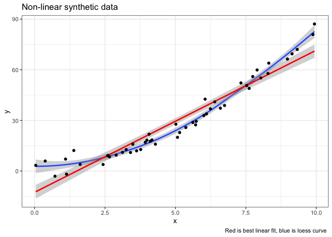
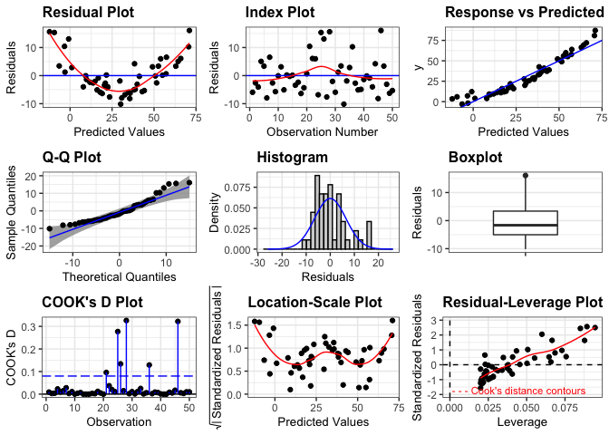
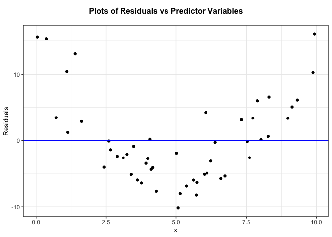
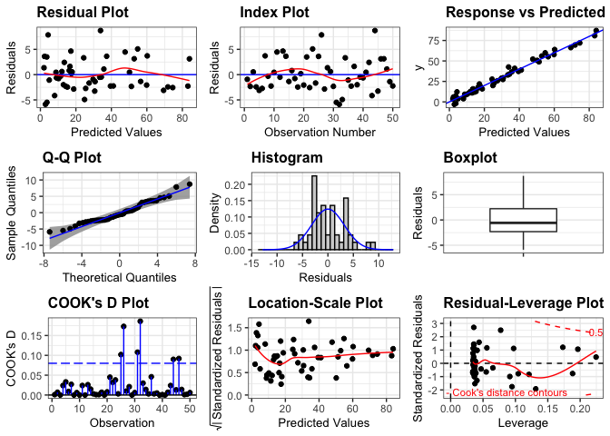
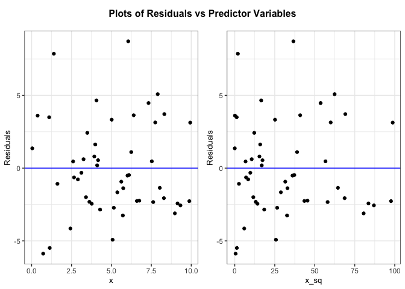
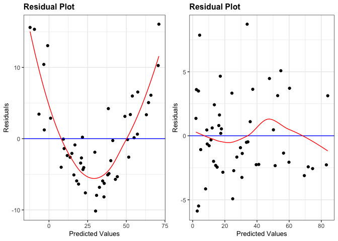

Checking Assumptions
================

Recall the 6 assumptions, specified by ROS, for regression models

1.  Validity
2.  Representativeness
3.  Additivity and linearity
4.  Independence of errors
5.  Equal variance of errors
6.  Normality of errors

Similar to HW 7, we will focus on assumptions 3, 4, 5, and 6.

### Additivity and linearity

#### Data Simulation

Consider data simulated from the model:

$$y = \beta_0 + \beta_1 x + \beta_2 x^2 + \epsilon,$$ where
$\epsilon \sim N(0,\sigma^2)$

``` r
set.seed(10102022)
n <- 50
x <- runif(n, 0, 10)
sigma <- 3
beta <- c(1,1,.75)

y <- rnorm(n, beta[1] + beta[2] * x + beta[3] * x^2,  sigma)
```

#### Data Visualization

If we visualize the data as a function of x, the response is clearly
non-linear.

``` r
d1 <- tibble(x = x, y = y, x_sq = x^2)
d1 %>% ggplot(aes(y=y, x=x)) + 
  geom_smooth(formula = 'y~x', method ='loess') + 
  geom_smooth(formula = 'y~x', method = 'lm', color = 'red') + 
  geom_point() +
  theme_bw() +
  ggtitle('Non-linear synthetic data') +
  labs(caption = "Red is best linear fit, blue is loess curve ")
```

<!-- -->

#### Data Modeling and Assessment

We’ll start with fitting a regression model corresponding to:

$$y = \beta_0 + \beta_1 x + \epsilon,$$ where
$\epsilon \sim N(0,\sigma^2)$

``` r
lm1 <- lm(y~x, data = d1)
summary(lm1)
```

    ## 
    ## Call:
    ## lm(formula = y ~ x, data = d1)
    ## 
    ## Residuals:
    ##     Min      1Q  Median      3Q     Max 
    ## -10.155  -5.032  -1.640   3.381  16.070 
    ## 
    ## Coefficients:
    ##             Estimate Std. Error t value Pr(>|t|)    
    ## (Intercept) -12.5763     2.0333  -6.185 1.31e-07 ***
    ## x             8.4170     0.3561  23.637  < 2e-16 ***
    ## ---
    ## Signif. codes:  0 '***' 0.001 '**' 0.01 '*' 0.05 '.' 0.1 ' ' 1
    ## 
    ## Residual standard error: 6.568 on 48 degrees of freedom
    ## Multiple R-squared:  0.9209, Adjusted R-squared:  0.9192 
    ## F-statistic: 558.7 on 1 and 48 DF,  p-value: < 2.2e-16

The `ggResidpanel` has nice functionality for residual checks and model
assessment.

``` r
#library(devtools)
#devtools::install_github("goodekat/ggResidpanel")
library(ggResidpanel)
resid_panel(lm1, plots = 'all', smoother = T, qqbands = T)
```

<!-- -->

``` r
# resid_interact(lm1, plots = c("resid", "qq")) # note won't compile in non HTML formats
resid_xpanel(lm1)
```

<!-- -->

#### Data Modeling and Assessment: Part 2

Now we’ll update our model, to the true model, such that:

$$y = \beta_0 + \beta_1 x + \beta_2 x^2 +  \epsilon,$$ where
$\epsilon \sim N(0,\sigma^2)$

``` r
lm2 <- lm(y~x + x_sq, data = d1)
summary(lm2)
```

    ## 
    ## Call:
    ## lm(formula = y ~ x + x_sq, data = d1)
    ## 
    ## Residuals:
    ##     Min      1Q  Median      3Q     Max 
    ## -5.8799 -2.3058 -0.5755  2.2237  8.7177 
    ## 
    ## Coefficients:
    ##             Estimate Std. Error t value Pr(>|t|)    
    ## (Intercept)  1.99667    1.57985   1.264    0.213    
    ## x            0.61073    0.67194   0.909    0.368    
    ## x_sq         0.76917    0.06384  12.048 5.63e-16 ***
    ## ---
    ## Signif. codes:  0 '***' 0.001 '**' 0.01 '*' 0.05 '.' 0.1 ' ' 1
    ## 
    ## Residual standard error: 3.283 on 47 degrees of freedom
    ## Multiple R-squared:  0.9806, Adjusted R-squared:  0.9798 
    ## F-statistic:  1191 on 2 and 47 DF,  p-value: < 2.2e-16

We see that the parameter coefficients are close to our true values.

``` r
resid_panel(lm2, plots = 'all', smoother = T, qqbands = T)
```

<!-- -->

``` r
resid_xpanel(lm2)
```

<!-- -->

Similarly, the residual plots are better behaved without a clear
pattern.

``` r
resid_compare(models = list(lm1, 
                            lm2),
              plots = c("resid"),
              smoother = TRUE)
```

<!-- -->

### Next Steps:

Work through other scenario(s) where 1 or more of the other assumptions
are violated
